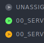
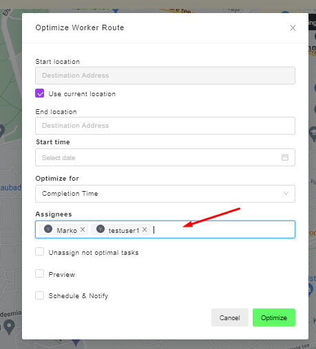

# [Dashboard](https://app.gsmtasks.com/dashboard)
## Worker status

  - Grey = offline
  - green = online
  - orange = on-duty, not GPS position update for at least 15 minutes

## Multi-driver route optimisation

![Click [Optimize worker route]](dashboard/multi-driver-optimise-1.png)

1. Make sure the tasks you want to optimise are unassigned
2. Right-click on the UNASSIGNED header
3. Click [Optimize worker route]
4. In the assignee section select all the workers you wish to assign the tasks to
5. Continue as usual

